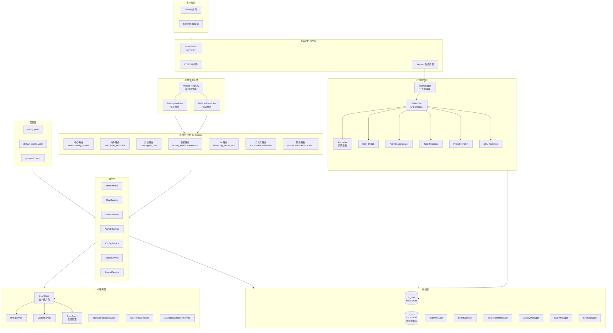
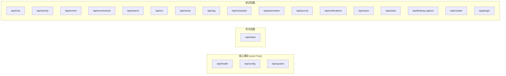
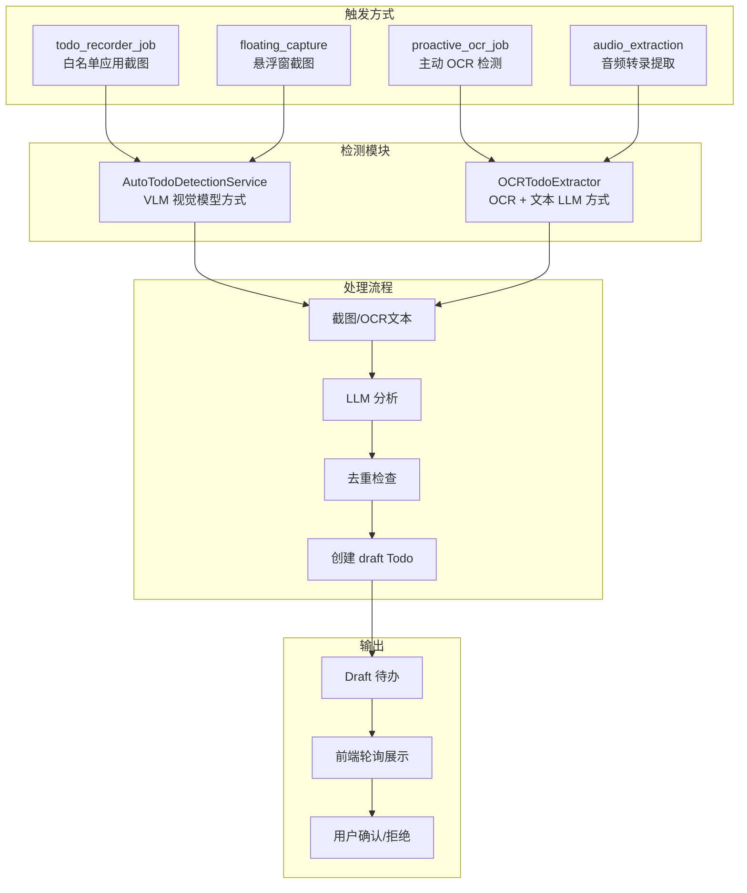
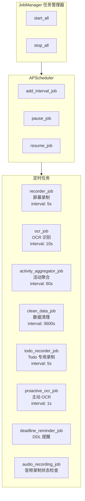
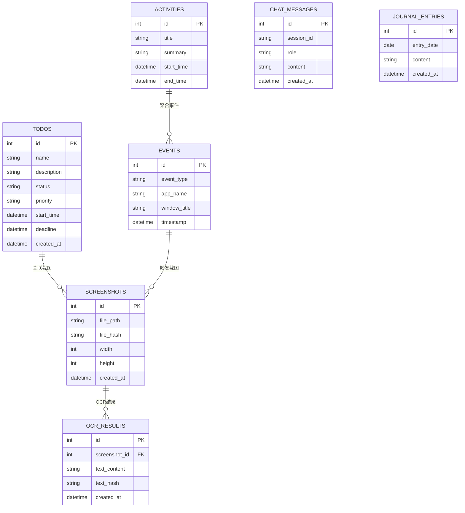
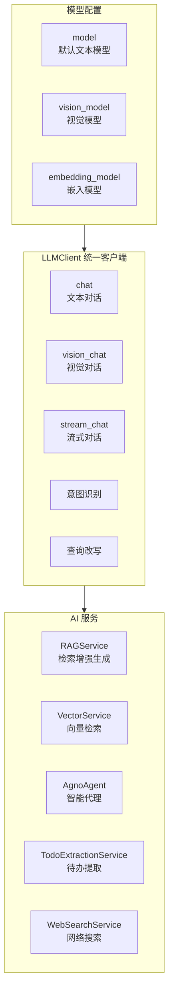
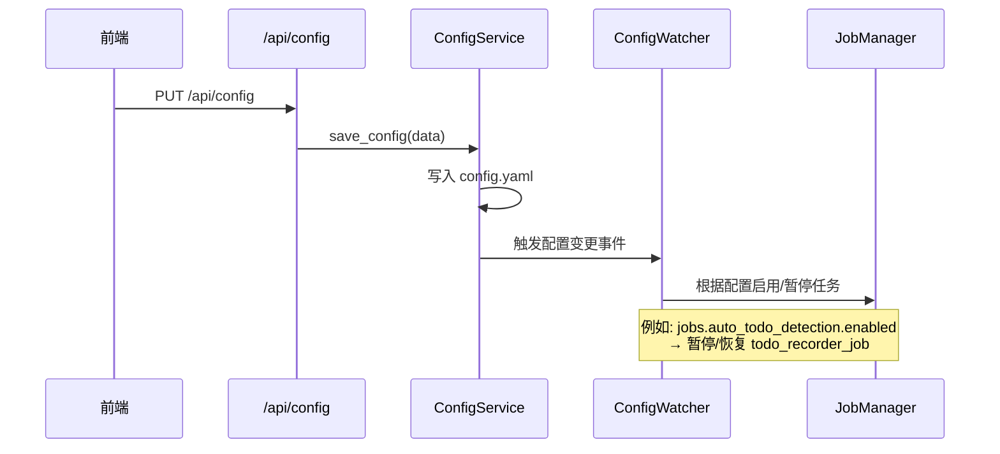

# FreeTodo 后端架构文档

## 1. 整体架构概览



---

## 2. 分层架构详解

### 2.1 路由层 (Routers)



### 2.2 待办检测功能架构



---

## 3. 后台任务系统



---

## 4. 存储层架构



---

## 5. LLM 服务架构



---

## 6. 配置热更新机制



---

## 7. 目录结构

```
lifetrace/
├── server.py              # FastAPI 入口
├── core/                  # 核心模块
│   ├── module_registry.py # 模块注册系统
│   ├── config_watcher.py  # 配置热更新
│   ├── dependencies.py    # 依赖注入
│   └── lazy_services.py   # 延迟加载服务
├── routers/               # API 路由层
│   ├── todo.py            # 待办管理
│   ├── chat/              # 对话模块
│   ├── automation.py      # 自动化任务
│   └── ...
├── services/              # 业务服务层
│   ├── todo_service.py
│   ├── chat_service.py
│   └── ...
├── llm/                   # LLM 相关
│   ├── llm_client.py      # 统一 LLM 客户端
│   ├── rag_service.py     # RAG 服务
│   ├── agno_agent.py      # Agno 智能代理
│   ├── auto_todo_detection_service.py  # VLM 待办检测
│   ├── ocr_todo_extractor.py           # OCR 待办提取
│   └── ...
├── jobs/                  # 后台任务
│   ├── job_manager.py     # 任务管理器
│   ├── recorder.py        # 屏幕录制
│   ├── todo_recorder.py   # Todo 专用录制
│   ├── proactive_ocr/     # 主动 OCR
│   └── ...
├── storage/               # 数据存储层
│   ├── database.py        # 数据库连接
│   ├── models.py          # ORM 模型
│   ├── todo_manager.py    # 待办管理器
│   └── ...
├── schemas/               # Pydantic 数据模型
├── config/                # 配置文件
│   ├── default_config.yaml
│   └── prompts/           # LLM 提示词
├── util/                  # 工具函数
└── migrations/            # 数据库迁移
```

---

## 8. 关键配置项

| 配置路径 | 说明 | 默认值 |
|----------|------|--------|
| `server.host` | 服务器地址 | `127.0.0.1` |
| `server.port` | 服务器端口 | `8001` |
| `llm.model` | 默认 LLM 模型 | - |
| `llm.vision_model` | 视觉模型 | - |
| `jobs.recorder.enabled` | 屏幕录制开关 | `false` |
| `jobs.auto_todo_detection.enabled` | 自动待办检测开关 | `false` |
| `jobs.proactive_ocr.enabled` | 主动 OCR 开关 | `false` |
| `jobs.proactive_ocr.params.auto_extract_todos` | OCR 文本待办提取 | `true` |
| `vector_db.enabled` | 向量数据库开关 | `true` |

---

## 9. API 端点汇总

| 模块 | 端点前缀 | 主要功能 |
|------|----------|----------|
| health | `/api/health` | 健康检查 |
| config | `/api/config` | 配置管理 |
| todo | `/api/todos` | 待办 CRUD |
| chat | `/api/chat` | AI 对话 |
| activity | `/api/activity` | 活动管理 |
| event | `/api/events` | 事件管理 |
| screenshot | `/api/screenshots` | 截图管理 |
| ocr | `/api/ocr` | OCR 识别 |
| vector | `/api/vector` | 向量操作 |
| rag | `/api/rag` | RAG 检索 |
| scheduler | `/api/scheduler` | 任务调度 |
| automation | `/api/automation` | 自动化任务 |
| journal | `/api/journal` | 日记管理 |
| notification | `/api/notifications` | 通知管理 |
| vision | `/api/vision` | 视觉分析 |
| audio | `/api/audio` | 音频处理 |
| floating_capture | `/api/floating-capture` | 悬浮窗截图 |
