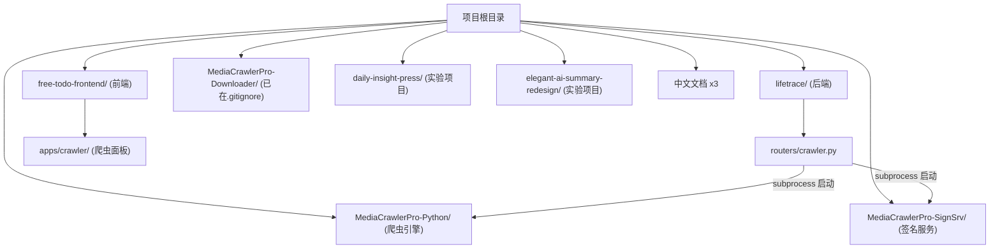
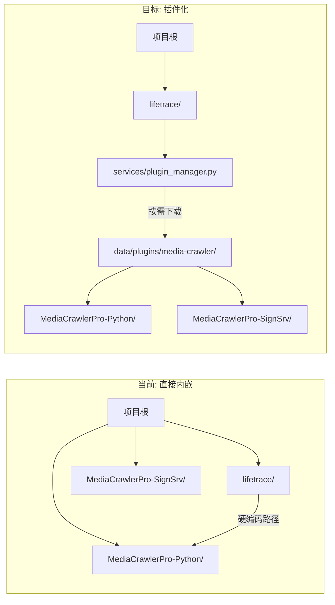

# MediaCrawler 插件化整合方案

## 现状分析

当前 `yaozhonghong_freetodo_mediacrawlerpro` 的结构：




**核心问题**：`crawler.py` 通过硬编码的 `PROJECT_ROOT / "MediaCrawlerPro-Python"` 路径直接启动子进程，要求这两个目录必须与 `lifetrace/` 同级。FreeToDo 主仓库不包含这些目录，合并后会导致爬虫功能无法找到引擎。

---

## 方案总览（6 个阶段）


---

## 阶段 1：文件清理与整理

### 1.1 删除不必要的文件和目录

以下文件/目录不属于 FreeToDo，应该删除或加入 `.gitignore`：


| 文件/目录                                     | 操作                                  | 原因                          |
| ----------------------------------------- | ----------------------------------- | --------------------------- |
| `daily-insight-press/`                    | 加入 `.gitignore`                     | 实验性 UI 项目，非核心功能             |
| `elegant-ai-summary-redesign/`            | 加入 `.gitignore`                     | 实验性 UI 项目，非核心功能             |
| `产品说明文档.md`                               | 移到 `.github/docs/` 或加入 `.gitignore` | 不应放在根目录                     |
| `技术开发架构文档.md`                             | 同上                                  | 同上                          |
| `雷达早报产品文档.md`                             | 同上                                  | 同上                          |
| `MediaCrawlerPro-Python/.github/`         | 不提交                                 | 原项目的 issue 模板，与 FreeToDo 冲突 |
| `MediaCrawlerPro-Python/CLAUDE.md`        | 不提交                                 | 原项目的 AI 指引                  |
| `MediaCrawlerPro-Python/project_tree.md`  | 不提交                                 | 手动维护的目录树                    |
| `MediaCrawlerPro-Python/static/img*.png`  | 不提交                                 | 原项目文档截图（6个）                 |
| `MediaCrawlerPro-Python/.venv/`           | 确认在 .gitignore                      | 虚拟环境                        |
| `MediaCrawlerPro-Python/data/`            | 确认在 .gitignore                      | 运行时数据                       |
| `MediaCrawlerPro-SignSrv/.github/`        | 不提交                                 | 同上                          |
| `MediaCrawlerPro-SignSrv/project_tree.md` | 不提交                                 | 同上                          |


### 1.2 修改根目录 `.gitignore`

在 [.gitignore](.gitignore) 中添加：

```gitignore
# 实验性项目（不提交）
daily-insight-press/
elegant-ai-summary-redesign/

# MediaCrawlerPro 运行时数据
MediaCrawlerPro-Python/data/
MediaCrawlerPro-Python/.venv/
MediaCrawlerPro-Python/logs/
MediaCrawlerPro-Python/browser_data/
MediaCrawlerPro-SignSrv/.venv/
MediaCrawlerPro-SignSrv/logs/

# 视频文件（防止大文件提交）
*.mp4
*.avi
*.mkv
*.mov
```

---

## 阶段 2：创建后端插件管理器

### 2.1 新建插件管理模块

创建文件 `lifetrace/services/plugin_manager.py`，负责管理可选插件的下载、安装、卸载。

**核心逻辑**：

```python
# lifetrace/services/plugin_manager.py（概念设计）

PLUGIN_BASE_DIR = Path(DATA_DIR) / "plugins"  # lifetrace/data/plugins/

class MediaCrawlerPlugin:
    """MediaCrawler 插件管理"""

    PLUGIN_ID = "media-crawler"
    # 插件下载 URL（指向 GitHub Release）
    DOWNLOAD_URL = "https://github.com/FreeU-group/LifeTrace/releases/download/plugins/{version}/media-crawler-{platform}-{version}.zip"

    @property
    def install_dir(self) -> Path:
        """插件安装目录: lifetrace/data/plugins/media-crawler/"""
        return PLUGIN_BASE_DIR / self.PLUGIN_ID

    @property
    def crawler_dir(self) -> Path:
        """爬虫引擎目录"""
        return self.install_dir / "MediaCrawlerPro-Python"

    @property
    def sign_srv_dir(self) -> Path:
        """签名服务目录"""
        return self.install_dir / "MediaCrawlerPro-SignSrv"

    def is_installed(self) -> bool:
        """检查插件是否已安装"""
        return self.crawler_dir.exists() and self.sign_srv_dir.exists()

    async def download_and_install(self, progress_callback) -> bool:
        """下载并安装插件"""
        # 1. 下载 zip 包
        # 2. 解压到 install_dir
        # 3. 创建 venv 并安装依赖
        # 4. 返回安装结果

    async def uninstall(self) -> bool:
        """卸载插件（删除目录）"""

    def get_status(self) -> dict:
        """获取插件状态（是否安装、版本等）"""
```

### 2.2 新建插件 API 路由

创建文件 `lifetrace/routers/plugin.py`：

```python
# lifetrace/routers/plugin.py
router = APIRouter(prefix="/api/plugins", tags=["plugins"])

@router.get("/media-crawler/status")
async def get_media_crawler_status():
    """返回插件安装状态"""
    return {
        "installed": plugin_manager.is_installed(),
        "version": plugin_manager.get_installed_version(),
        "latest_version": "1.0.0",
        "download_size": "约150MB",
    }

@router.post("/media-crawler/install")
async def install_media_crawler():
    """流式返回安装进度"""
    # 下载 → 解压 → 安装依赖 → 完成

@router.post("/media-crawler/uninstall")
async def uninstall_media_crawler():
    """卸载插件"""
```

### 2.3 在模块注册系统中注册 plugin 模块

在 [lifetrace/core/module_registry.py](lifetrace/core/module_registry.py) 的 `MODULES` 元组中添加：

```python
ModuleDefinition(id="plugin", router_module="lifetrace.routers.plugin"),
```

---

## 阶段 3：修改 crawler.py 支持动态路径

### 3.1 路径解析改为动态

修改 [lifetrace/routers/crawler.py](lifetrace/routers/crawler.py)，将硬编码的路径改为动态解析：

**当前代码**（第 28-43 行）：

```python
PROJECT_ROOT = Path(__file__).parent.parent.parent
CRAWLER_DIR = PROJECT_ROOT / "MediaCrawlerPro-Python"
SIGN_SRV_DIR = PROJECT_ROOT / "MediaCrawlerPro-SignSrv"
```

**修改为**：

```python
from lifetrace.services.plugin_manager import MediaCrawlerPlugin

_plugin = MediaCrawlerPlugin()

def _get_crawler_dir() -> Path | None:
    """动态获取爬虫目录（优先从插件目录查找）"""
    # 1. 先检查插件安装目录
    if _plugin.crawler_dir.exists():
        return _plugin.crawler_dir
    # 2. 再检查项目根目录（开发模式兼容）
    dev_path = Path(__file__).parent.parent.parent / "MediaCrawlerPro-Python"
    if dev_path.exists():
        return dev_path
    return None

def _get_sign_srv_dir() -> Path | None:
    """动态获取签名服务目录"""
    if _plugin.sign_srv_dir.exists():
        return _plugin.sign_srv_dir
    dev_path = Path(__file__).parent.parent.parent / "MediaCrawlerPro-SignSrv"
    if dev_path.exists():
        return dev_path
    return None
```

### 3.2 所有引用路径的地方都改为调用这些函数

文件中有约 **15 处**引用了 `CRAWLER_DIR`、`SIGN_SRV_DIR`、`CRAWLER_CONFIG_PATH` 等变量。需要全部替换为动态函数调用，并在找不到目录时返回友好的错误消息（提示用户安装插件）。

### 3.3 添加插件状态检查端点

在 `/api/crawler/status` 中增加插件安装状态：

```python
@router.get("/status")
async def get_crawler_status():
    return {
        "status": _crawler_status,
        "plugin_installed": _plugin.is_installed(),  # 新增
        # ... 其他字段
    }
```

---

## 阶段 4：前端适配

### 4.1 修改爬虫面板，显示插件安装提示

修改 [free-todo-frontend/apps/crawler/CrawlerPanel.tsx](free-todo-frontend/apps/crawler/CrawlerPanel.tsx)，在 `plugin_installed === false` 时显示安装引导界面：

```
┌──────────────────────────────────┐
│        媒体爬虫插件              │
│                                  │
│   该功能需要安装 MediaCrawler    │
│   插件才能使用                  │
│                                  │
│   插件大小：约 150MB            │
│                                  │
│   [  安装插件  ]                │
│                                  │
│   安装后可以：                   │
│   - 爬取 7 大社交媒体平台内容   │
│   - 查看热点速递和 AI 总结      │
│   - 下载视频和图片              │
└──────────────────────────────────┘
```

### 4.2 修改 Zustand Store

修改 [free-todo-frontend/apps/crawler/store.ts](free-todo-frontend/apps/crawler/store.ts)，增加插件状态管理：

```typescript
interface CrawlerStore {
  // 新增
  pluginInstalled: boolean;
  pluginInstalling: boolean;
  installProgress: number;
  checkPluginStatus: () => Promise<void>;
  installPlugin: () => Promise<void>;
  // ... 现有字段
}
```

### 4.3 不需要改动的部分

以下文件**不需要改动**，它们已经符合 FreeToDo 的架构规范：

- `free-todo-frontend/lib/plugins/registry.ts` - 已正确注册为 lazy-loaded 插件
- `free-todo-frontend/lib/config/panel-config.ts` - 已正确配置面板
- `free-todo-frontend/apps/crawler/components/` - 已使用 React 组件规范

---

## 阶段 5：打包 MediaCrawler 插件并发布

### 5.1 创建插件打包脚本

创建文件 `scripts/build_media_crawler_plugin.py`：

```python
"""将 MediaCrawlerPro-Python 和 MediaCrawlerPro-SignSrv 打包为可下载的插件 zip"""
# 1. 清理 __pycache__、.venv、data/、logs/ 等运行时文件
# 2. 清理 .github/、static/img*.png 等不必要文件
# 3. 将两个目录打包为 media-crawler-v{version}.zip
# 4. 生成 manifest.json（版本、哈希、大小等元信息）
```

### 5.2 插件 zip 包结构

```
media-crawler-v1.0.0.zip
├── manifest.json              # 插件元信息
├── MediaCrawlerPro-Python/    # 爬虫引擎（清理后）
│   ├── main.py
│   ├── config/
│   ├── media_platform/
│   ├── requirements.txt
│   └── ...
└── MediaCrawlerPro-SignSrv/   # 签名服务（清理后）
    ├── app.py
    ├── apis/
    ├── requirements.txt
    └── ...
```

### 5.3 发布到 GitHub Releases

在 FreeToDo 的 GitHub 仓库创建一个 Release（tag 为 `plugin/media-crawler/v1.0.0`），上传 zip 包。后端 `plugin_manager.py` 的下载 URL 指向这个 Release。

---

## 阶段 6：合并到 FreeToDo

### 6.1 需要提交到 FreeToDo 的文件清单

这些文件是你的工作成果，需要合并到 FreeToDo 主仓库：

**后端（新增/修改）**：

- `lifetrace/routers/crawler.py` - 修改后（动态路径）
- `lifetrace/routers/plugin.py` - 新增（插件管理 API）
- `lifetrace/services/plugin_manager.py` - 新增（插件管理逻辑）
- `lifetrace/core/module_registry.py` - 修改（添加 plugin 模块）
- `lifetrace/config/default_config.yaml` - 修改（如有新增配置项）

**前端（新增/修改）**：

- `free-todo-frontend/apps/crawler/` - 整个目录（你新增的）
- `free-todo-frontend/apps/settings/components/CrawlerConfigSection.tsx`
- `free-todo-frontend/apps/settings/components/CookiesConfigSection.tsx`
- `free-todo-frontend/lib/plugins/registry.ts` - 修改（添加 crawler 注册）
- `free-todo-frontend/lib/config/panel-config.ts` - 修改
- `free-todo-frontend/lib/i18n/messages/zh.json` - 修改（添加翻译）
- `free-todo-frontend/lib/i18n/messages/en.json` - 修改
- `free-todo-frontend/apps/chat/` 下与 crawler 集成的文件

### 6.2 不应该提交到 FreeToDo 的文件


| 目录/文件                          | 原因                |
| ------------------------------ | ----------------- |
| `MediaCrawlerPro-Python/`      | 作为插件包单独发布         |
| `MediaCrawlerPro-SignSrv/`     | 作为插件包单独发布         |
| `MediaCrawlerPro-Downloader/`  | 已废弃               |
| `daily-insight-press/`         | 实验项目              |
| `elegant-ai-summary-redesign/` | 实验项目              |
| `产品说明文档.md` 等中文文档              | 放到团队内部文档          |
| `FreeTodo/`                    | 参考用，已在 .gitignore |


### 6.3 合并步骤

```bash
# 1. 在 FreeToDo 主仓库创建你的功能分支
git checkout dev
git pull
git checkout -b feat/yaozhonghong/media-crawler-plugin

# 2. 将你的改动文件复制/cherry-pick 到这个分支
# （只复制上面 6.1 清单中的文件）

# 3. 确保 .gitignore 不包含 MediaCrawlerPro-Python/
# （因为 FreeToDo 主仓库本来就没有这些目录）

# 4. 提交并创建 PR
git add .
git commit -m "feat(crawler): add media crawler plugin with on-demand installation"
git push origin feat/yaozhonghong/media-crawler-plugin

# 5. 在 GitHub 上创建 PR，目标分支为 dev
```

---

## 实施顺序与时间估算


| 阶段     | 描述               | 预计工作量     |
| ------ | ---------------- | --------- |
| 阶段 1   | 文件清理与 .gitignore | 0.5 天     |
| 阶段 2   | 后端插件管理器          | 1-2 天     |
| 阶段 3   | 修改 crawler.py    | 1 天       |
| 阶段 4   | 前端适配             | 1 天       |
| 阶段 5   | 打包脚本与发布          | 0.5 天     |
| 阶段 6   | 合并到 FreeToDo     | 0.5 天     |
| **总计** |                  | **4-5 天** |


---

## 架构对比


