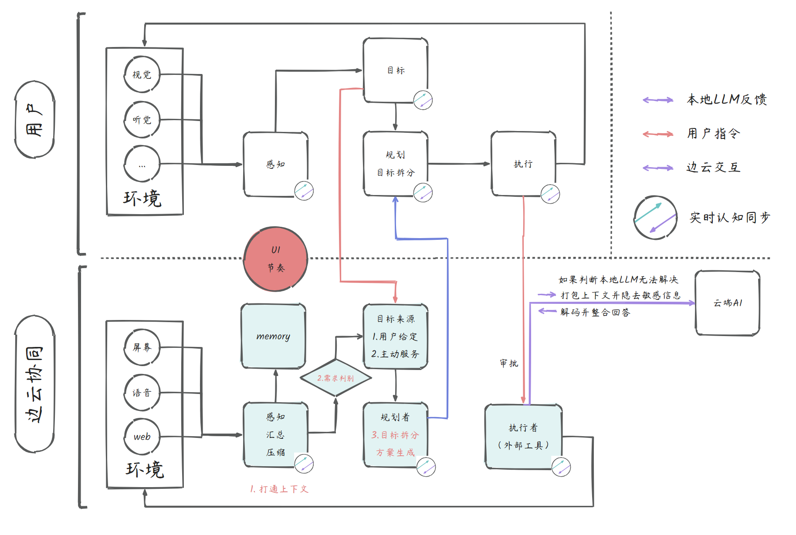

# FreeU 整体架构实现

> 本文档从**物理空间**与**逻辑空间**两个维度描述 FreeU 的整体架构。

---

## 一、双维架构总览（逻辑空间 × 物理空间）

> **核心原则**：PC / 移动 / 硬件端本质上都是**终端 IO**——主要提供感知采集和结果展示能力；所有重度处理（记忆、意图识别、规划执行）集中在中心存算一体节点完成。Web 端定位为账号管理与数据同步入口。

|  | **中心存算一体节点** | **PC 端** | **移动端** | **硬件端** | **Web 端** |
|:---:|:---:|:---:|:---:|:---:|:---:|
| **定位** | 大脑（全量处理） | 主力终端 IO | 辅助终端 IO | 传感终端 IO | 账号管理与同步 |
| **感知** | 多模态数据融合<br>跨端感知汇聚 | 屏幕 OCR<br>系统音频 ASR<br>键鼠行为流 | 推送接收<br>传感器 / GPS | 麦克风阵列<br>摄像头<br>环境传感器 | — |
| **记忆** | 统一知识图谱<br>向量数据库<br>长期记忆存储 | 感知数据临时缓存 | 会话临时缓存 | 边缘临时缓存 | — |
| **意图识别** | 深度意图理解<br>多模态意图融合<br>歧义消解 | 唤醒词检测<br>基础事件过滤 | 唤醒词检测 | 唤醒词检测 | — |
| **规划执行** | 全局任务编排<br>复杂推理链<br>Agent 调度中枢 | 结果展示<br>通知卡片交互 | 通知推送<br>结果展示 | — | — |

> **阅读方式：** 列（↓）= 物理部件在各逻辑层的职责；行（→）= 同一逻辑能力在各端的分布。终端越轻（右侧列），承担的逻辑越少。

---

## 二、物理空间架构：私有云 + 公有云拓扑

所有终端**先连接私有云（以存算一体节点为核心）**，再由私有云统一对接公有云。用户数据默认留在私有域内，仅按需与公有云交互。

```
                          ┌─────────────────────────┐
                          │       公 有 云            │
                          │  (LLM API / 三方服务 /   │
                          │   云端扩展算力)           │
                          └────────────┬────────────┘
                                       │
                                  加密隧道 / API
                                       │
              ┌────────────────────────────────────────────────┐
              │            私 有 云 (家庭/个人)                  │
              │  ┌──────────────────────────────────────────┐  │
              │  │       中心存算一体节点 (Core Node)         │  │
              │  │                                          │  │
              │  │  · 统一知识图谱 & 向量数据库               │  │
              │  │  · Agent 调度中枢                         │  │
              │  │  · 多模态融合 & 深度推理                   │  │
              │  │  · 全局任务编排                            │  │
              │  │  · 数据同步 & 备份                         │  │
              │  └──────────────────────────────────────────┘  │
              │         │          │          │          │      │
              └─────────┼──────────┼──────────┼──────────┼──────┘
                        │          │          │          │
             ┌──────────┴┐   ┌────┴─────┐  ┌┴────────┐ ┌┴────────┐
             │  PC 端     │   │ 移动端    │  │ 硬件端   │ │ Web 端   │
             │ (主力 IO)  │   │(辅助 IO) │  │(传感IO) │ │          │
             │ 屏幕/音频  │   │ 通知推送  │  │ 录音豆 / │ │ 账号管理 │
             │ 感知+交互  │   │ 结果展示  │  │ 耳机 /  │ │ 数据同步 │
             │            │   │          │  │ 眼镜    │ │          │
             └────────────┘   └──────────┘  └─────────┘ └─────────┘
```

### 架构要点

| 层级 | 定位 | 说明 |
|:---|:---|:---|
| **公有云** | 弹性算力 | 提供大模型 API 调用、三方 SaaS 集成、弹性扩展算力；私有云按需上联 |
| **私有云（存算一体节点）** | 系统大脑 | 集中承载记忆存储、意图识别、Agent 调度、规划执行等**全部核心逻辑**，保障数据隐私 |
| **PC 端** | 主力终端 IO | 提供最丰富的感知能力（屏幕 OCR、音频 ASR、键鼠行为流）和通知卡片交互；本地仅做感知数据临时缓存和唤醒词检测，重度处理上传中心节点 |
| **移动端** | 辅助终端 IO | 通知推送、结果展示、传感器数据采集（GPS 等）；本地仅做会话临时缓存和唤醒词检测 |
| **硬件端** | 传感终端 IO | 录音豆/耳机/未来 AI 眼镜，纯感知数据采集上传；本地仅做边缘临时缓存和唤醒词检测 |
| **Web 端** | 账号管理与同步 | 提供跨平台的账号登录、设备绑定、数据同步能力；不处理感知/记忆/意图识别/规划执行 |

### 数据流向

```
终端（PC / 移动 / 硬件 / Web）
        │
        │  局域网 / 安全通道
        ▼
   私有云（存算一体节点）
        │
        │  按需上联（加密）
        ▼
      公有云
```

- **默认路径**：终端 ↔ 私有云，数据不出域
- **按需路径**：私有云 ↔ 公有云，仅在本地算力不足或需要外部服务时上联

### 轻量部署模式：PC 兼任私有云

> 现实中大多数用户并不具备独立的存算一体节点（NAS/家庭服务器）。此时 **PC 自身承担私有云的角色**，存算一体节点与 PC 端合为一体。核心链路为 **PC（兼私有云）+ 公有云**，移动端和硬件设备作为**可选扩展**接入。

```
                     ┌─────────────────────────┐
                     │        公 有 云           │
                     │  (LLM API / 三方服务 /   │
                     │   云端扩展算力)           │
                     └────────────┬────────────┘
                                  │
                             加密 API
                                  │
  ┌───────────────────────────────┴───────────────────────────────┐
  │                    PC 端（兼私有云）                            │
  │  ┌─────────────────────────────────────────────────────────┐  │
  │  │  Desktop Agent + 本地存算一体服务                         │  │
  │  │                                                         │  │
  │  │  · 屏幕感知 / 音频采集 / 键鼠行为流                      │  │
  │  │  · 本地知识库 & 向量数据库                                │  │
  │  │  · Agent 调度 & 本地推理引擎                              │  │
  │  │  · 全局任务编排                                           │  │
  │  └─────────────────────────────────────────────────────────┘  │
  │                              │                                │
  └──────────────────────────────┼────────────────────────────────┘
                                 │
                            HTTP (局域网)
                                 │
                     ┌───────────┴───────────┐    ┌ ─ ─ ─ ─ ─ ─ ─ ─ ─ ┐
                     │       移动端 (可选)      │       硬件端 (可选)
                     │       Mobile APP       │    │                   │
                     │    通知推送 / 结果展示   │      录音豆 / 耳机
                     │                        │    │  未来 AI 眼镜     │
                     │            ▲           │
                     └────────────┼───────────┘    └ ─ ─ ─ ─ ┬ ─ ─ ─ ┘
                                  │                           │
                                  └─────── 蓝牙 ──────────────┘
```

> 硬件设备通过**蓝牙**连接到移动端，移动端再通过 **HTTP** 连接到 PC（私有云）。虚线框表示可选组件。

**与完整模式的对比：**

| 维度 | 完整模式（独立存算一体节点） | 轻量模式（PC 兼任） |
|:---|:---|:---|
| **私有云载体** | 独立 NAS / 家庭服务器，7×24 在线 | PC 本机，开机即在线 |
| **必备终端** | PC + 移动 + 硬件 + Web + 中心节点 | PC（含中心能力）+ 公有云 |
| **可选终端** | — | 移动端、硬件端（按需接入） |
| **硬件接入方式** | 硬件 → 私有云（直连） | 硬件 → 移动端（蓝牙）→ PC 私有云（HTTP） |
| **可用性** | 中心节点常驻，终端可离线 | PC 关机时系统暂停 |
| **算力上限** | 中心节点可配独立 GPU，PC 端释放资源 | 受限于 PC 本机硬件，感知+推理共享资源 |
| **适用人群** | 重度用户 / 多设备家庭 | **大多数早期用户（MVP 默认模式）** |

> **MVP 阶段优先支持轻量模式**——最低只需一台 PC 即可运行完整逻辑链路；有手机可扩展移动场景，有硬件设备可扩展环境感知。待需求增长后，平滑升级到独立存算一体节点的完整拓扑。

---

## 三、逻辑空间架构：感知 → 记忆 → 意图识别 → 规划执行



上图展示了逻辑架构的核心设计——**以人类认知流程为蓝本，构建系统侧的镜像流程**，分为上下两层，中间通过 UI 节点连接。

### 上层：用户认知流程

```
环境（视觉、听觉…） → 感知 → 目标 → 规划 / 目标拆分 → 执行
```

### 下层：边云协同系统流程（系统对用户认知的镜像）

| 阶段 | 系统行为 |
|:---|:---|
| **环境感知** | 屏幕、语音、Web 等多模态输入 → 感知汇总压缩 |
| **记忆 (Memory)** | 持久化存储与检索历史上下文和个人知识 |
| **意图识别 / 目标来源** | ① 用户给定（显式指令）② 主动服务（系统主动识别） |
| **规划** | 目标拆分 + 方案生成 |
| **执行** | 调用外部工具完成任务，结果经审批回路确认 |

> 各模块的详细设计请参阅 [主动服务 Agent 设计](./1_主动服务Agent设计.md)。

---
