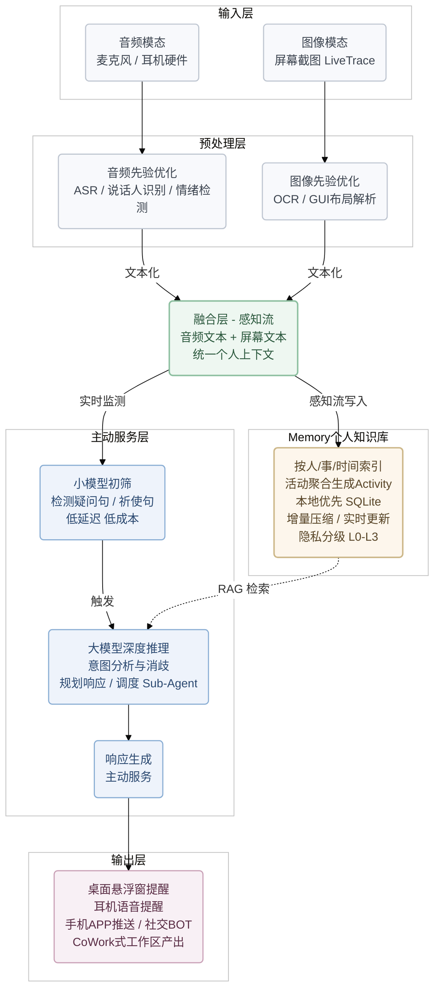

# FreeU 技术架构与实现方案

> 本文档从 PRD v2602 中提取的技术实现细节，描述"怎么做"。
> 产品层面的"做什么"请参见 `2.1_产品定义与MVP/PRD/FreeU助手PRD_v2602.md`。

---

## 一、主动服务agent架构

产品的完全体是**音频模态 + PC图像模态（屏幕截图）的深度融合**，形成Y字形架构：

```
┌────────────────────────────────────────────────────────────────────────┐
│                          输入层（多模态数据采集）                          │
├─────────────────────────────┬──────────────────────────────────────────┤
│       音频模态               │           图像模态（PC截屏）               │
│  ┌─────────────────────┐    │    ┌─────────────────────────────────┐  │
│  │ • 麦克风/耳机硬件     │    │    │ • 屏幕定时截图（LiveTrace）      │  │
│  └─────────────────────┘    │    └─────────────────────────────────┘  │
└─────────────────────────────┴──────────────────────────────────────────┘
                │                                    │
                ▼                                    ▼
┌────────────────────────────────────────────────────────────────────────┐
│                        预处理层（模态专属优化）                           │
├─────────────────────────────┬──────────────────────────────────────────┤
│      音频先验优化             │          图像先验优化                     │
│  ┌─────────────────────┐    │    ┌─────────────────────────────────┐  │
│  │ • 语音转文本（ASR）   │    │    │ • OCR文字提取                   │  │
│  │ • 说话人音色识别      │    │    │ • GUI布局解析                   │  │
│  │ • 语气/情绪检测      │    │    │   - 微信消息结构                │  │
│  │ • 说话人标注         │    │    │   - 飞书界面布局                │  │
│  └─────────────────────┘    │    │   - 其他社交软件                │  │
│                             │    └─────────────────────────────────┘  │
└─────────────────────────────┴──────────────────────────────────────────┘
                │                                    │
                ▼                                    ▼
            【文本化】                            【文本化】
                │                                    │
                └──────────────┬─────────────────────┘
                               ▼
┌────────────────────────────────────────────────────────────────────────┐
│                    融合层（多模态数据汇聚 - 感知流）                      │
├────────────────────────────────────────────────────────────────────────┤
│  • 音频文本 + 屏幕文本 → 统一的个人上下文                                │
│  • 携带元信息：时间戳、说话人、来源APP、事件类型                          │
└────────────────────────────────────────────────────────────────────────┘
                               │
                ┌──────────────┴───────────────┐
                ▼                               ▼

┌──────────────────────────┐            ┌─────────────────────────────────────┐
│   Memory（个人知识库）    │            │    主动服务层（Proactive Agent）      │
├──────────────────────────┤            ├─────────────────────────────────────┤
│                          │            │                                     │
│  • 按人/事/时间索引      │  ◄── 写入  │  ┌──────────┐    ┌──────────────┐  │
│  • 活动聚合→Activity    │            │  │  小模型   │ →  │  大模型深度   │  │
│  • 本地优先（SQLite）    │  ──► 读取  │  │  初筛     │    │ (RAG+推理)   │  │
│  • 增量压缩，实时更新    │            │  └──────────┘    └──────┬───────┘  │
│  • 隐私分级（L0~L3）    │            │                         │          │
│                          │            │                         │          │
└──────────────────────────┘            │                         ▼          │
                                        │                ┌──────────────┐    │
  ◄── 写入：感知流持续灌入Memory        │                │   响应生成    │    │
  ──► 读取：大模型从Memory检索(RAG)     │                │  (主动服务)   │    │
                                        │                └──────┬───────┘    │
                                        └───────────────────────┼────────────┘
                                                                │
                                                                ▼
┌────────────────────────────────────────────────────────────────────────┐
│                          输出层（用户交互）                              │
├────────────────────────────────────────────────────────────────────────┤
│  • 桌面悬浮窗弹出提醒                                                  │
│  • 耳机语音提醒                                                        │
│  • 手机APP推送 / 社交软件BOT                                           │
│  • CoWork式工作区产出（报告、PPT等）                                    │
└────────────────────────────────────────────────────────────────────────┘

小模型职责：检测疑问句/祈使句，低延迟低成本实时初筛，判断是否触发大模型
大模型职责：意图分析与消歧，检索Memory（RAG），规划响应 + 调度Sub-Agent
```

### Mermaid 版架构图



---

## 二、感知模块技术实现

感知层的具体实现（音频采集、屏幕采集、感知流融合与压缩等）详见 [1-1 感知流设计](./1-1_感知流设计.md)。

---

## 三、个人知识库（Memory）技术方案

Memory 模块的完整设计（写入、压缩、索引、动态学习）详见 [1-2 Memory 模块设计](./1-2_Memory模块设计.md)。

---

## 四、主动意图识别技术方案

意图识别模块的完整设计（意图分类、小模型初筛、大模型深度推理）详见 [1-3 意图识别设计](./1-3_意图识别设计.md)。

---

## 五、规划执行技术方案

规划执行模块的完整设计（执行能力分级、规划流程、审批机制）详见 [1-4 规划执行设计](./1-4_规划执行设计.md)。

---

## 六、用户交互方式

产品交互围绕一个核心原则：**90% 的时间用户不需要看到 AI，AI 在后台默默感知；只有在需要时才主动出现。**

整体交互由三个组件构成：

| 交互组件 | 定位 | 形态 |
|:---|:---|:---|
| **系统托盘图标** | 存在感 + 状态指示 + 入口 | 常驻系统托盘，不占用工作区 |
| **自定义通知卡片** | AI 主动服务的核心载体 | 屏幕右下角弹出的富交互卡片 |
| **主窗口** | 深度使用的完整工作台 | 全屏多面板模式 |

交互设计的完整定义（托盘状态、通知卡片结构、主窗口面板布局、隐私控制等）详见 [MVP 定义 PRD · 四、用户交互设计](../2.1_product_mvp/MVP定义_PRD.md#四用户交互设计)。

---

## 七、量化指标与开发路线

### 7.1 效果指标（Performance）

#### When — 意图检测准确率

| 指标           | 目标值                         | 说明                                   |
| -------------- | ------------------------------ | -------------------------------------- |
| 意图检测准确率 | ≥75%（MVP）→ ≥85%（成熟期） | 减少假阳性（打扰用户）和假阴性（漏检） |

#### How — 响应内容质量

| 指标           | 目标值 | 说明                             |
| -------------- | ------ | -------------------------------- |
| 响应内容准确率 | 待定   | 给出的建议/回复是否真正有用      |
| 信息检索召回率 | 待定   | 从个人知识库中找到相关信息的比例 |

### 7.2 延迟

| 指标           | 目标值  | 说明                           |
| -------------- | ------- | ------------------------------ |
| 端到端响应延迟 | ≤3秒   | 从检测到需求到给出响应的总时长 |
| 意图检测延迟   | ≤500ms | 小模型初筛的实时性要求         |

### 7.3 成本消耗

| 指标              | 目标值  | 说明                       |
| ----------------- | ------- | -------------------------- |
| 单次服务Token消耗 | 尽量低  | 保证商业可行性             |
| 设备续航          | ≥8小时 | 硬件录音设备               |
| 月均Token成本     | 待定    | 单用户月成本需低于订阅价格 |

### 7.4 感知覆盖

| 指标       | 目标值 | 说明                                     |
| ---------- | ------ | ---------------------------------------- |
| 数据覆盖率 | ≥90%  | 用户日常生活的信息覆盖，是一切效果的前提 |

### 7.5 开发路线（三步走）

1. **搭 Pipeline，验证 Performance**：先把音频+图像两条链路跑通，API 先用最强模型，不考虑成本
2. **量化指标**：建立指标体系（Performance、延迟、成本），构造数据集，找到堵点
3. **优化，验证商业可行性**：小模型微调降本、大模型选型比价、先验利用减少 Token，让商业模式跑通

---
